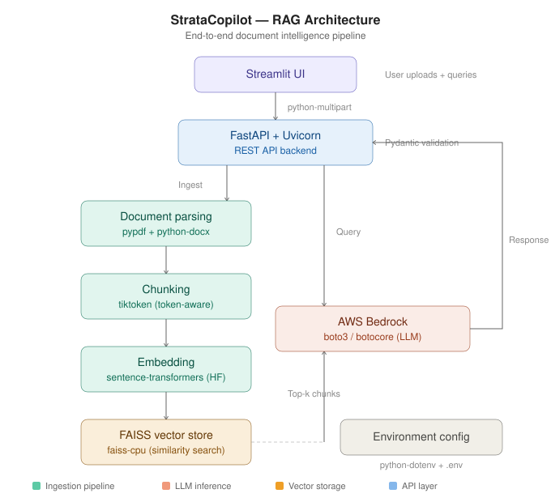

# StrataCopilot

**StrataCopilot** is a fully autonomous AI copilot for consulting firms that makes the entire process of knowledge extraction, document summarization, and intelligent Q&A dramatically faster and easier.

Upload PDFs and Word documents, ask natural language questions, and get context-aware answers powered by AWS Bedrock — all through a clean Streamlit interface.

## Architecture

<p align="center">
  
</p>

## How It Works

**Ingestion Pipeline:**
1. User uploads PDF or Word documents via the Streamlit UI
2. `pypdf` and `python-docx` parse the raw document content
3. `tiktoken` splits text into token-aware chunks with configurable overlap
4. `sentence-transformers` (Hugging Face) generates dense vector embeddings
5. Embeddings are indexed in a `FAISS` vector store for fast similarity search

**Query Pipeline:**
1. User submits a natural language question
2. The query is embedded using the same sentence-transformers model
3. FAISS retrieves the top-k most relevant document chunks
4. Retrieved chunks + query are sent to **AWS Bedrock** via `boto3` for LLM generation
5. The context-aware response is returned to the user through the Streamlit interface

## Tech Stack

| Layer | Technology |
|---|---|
| Frontend | Streamlit |
| Backend API | FastAPI + Uvicorn |
| Document Parsing | pypdf, python-docx |
| Chunking | tiktoken (token-aware) |
| Embeddings | sentence-transformers (Hugging Face) |
| Vector Store | FAISS (faiss-cpu) |
| LLM Inference | AWS Bedrock (boto3/botocore) |
| Data Validation | Pydantic |
| Config | python-dotenv |

## Getting Started

### Prerequisites
- Python 3.10+
- AWS account with Bedrock access
- AWS credentials configured (`~/.aws/credentials` or environment variables)

### Installation

```bash
git clone https://github.com/MobinEzzati/StrataCopilot.git
cd StrataCopilot
pip install -r requirements.txt
```

### Configuration

Create a `.env` file in the root directory:

```env
AWS_REGION=us-east-1
AWS_ACCESS_KEY_ID=your_access_key
AWS_SECRET_ACCESS_KEY=your_secret_key
```

### Run

```bash
# Start the FastAPI backend
uvicorn app.main:app --reload

# In a separate terminal, start the Streamlit UI
streamlit run app/streamlit_app.py
```

## Project Structure

```
StrataCopilot/
├── app/                    # Application source code
├── .gitignore
├── requirements.txt        # Python dependencies
├── architecture.svg        # Architecture diagram
└── Readme.Md
```

## Key Design Decisions

- **Token-aware chunking** with tiktoken ensures chunks respect token limits and don't split mid-sentence, improving retrieval quality
- **FAISS** chosen for vector search — runs locally with zero infrastructure overhead, ideal for POC and small-to-medium document sets
- **sentence-transformers** provides high-quality embeddings without requiring API calls for every document chunk
- **AWS Bedrock** via boto3 for LLM inference — enterprise-grade, no need to manage model infrastructure
- **FastAPI** backend separates the API layer from the UI, making it easy to swap frontends or add new endpoints

## Author

**Mobin Ezzati** — MS Computer Science, Southern Methodist University

- [LinkedIn](https://www.linkedin.com/in/mobin-ezzati-mscs-84b753153/)
- [GitHub](https://github.com/MobinEzzati)
